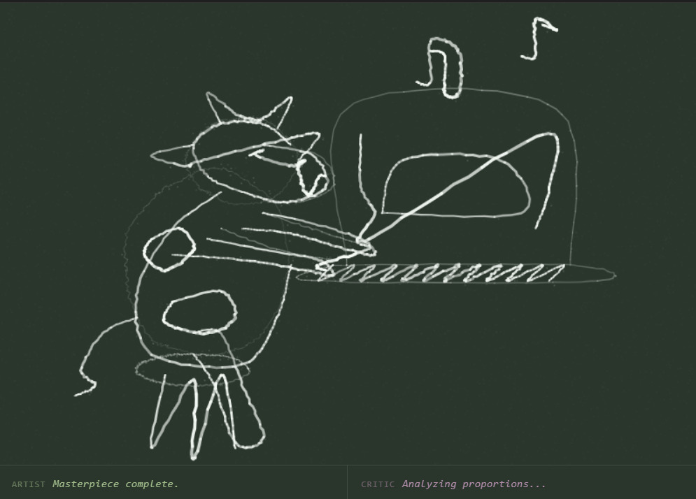
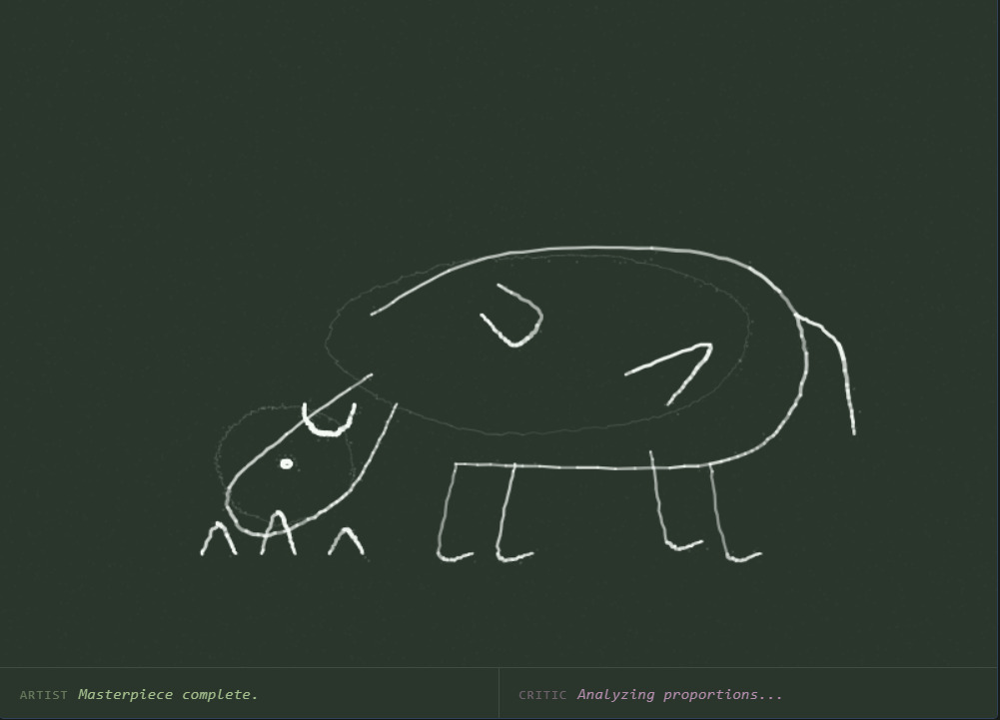
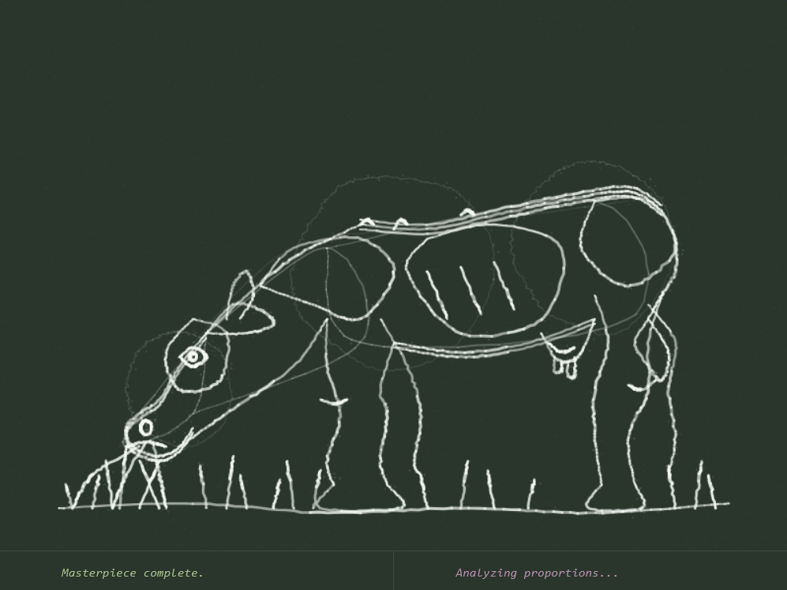

# Talking Chalk

A real-time AI co-creation canvas where you draw on a chalkboard and an AI companion adds to your drawing with playful chalk strokes — complete with a speaking voice.

## Screenshots

These drawings were generated entirely by the AI on the chalkboard canvas.

| | |
|---|---|
|  |  |



## How It Works

1. **You draw** on the chalkboard canvas with your mouse or touch.
2. After a **2-second pause**, the AI's turn begins.
3. A **filler phrase is spoken** immediately (via ElevenLabs TTS) to fill the silence while the AI thinks.
4. **Gemini Vision** analyses a snapshot of the canvas and streams back 1–3 chalk strokes as structured JSON.
5. The strokes are **animated onto the canvas** in real time as they arrive — no waiting for the full response.
6. Repeat — the canvas grows as a shared piece of art.

## Tech Stack

| Layer | Technology |
|---|---|
| Frontend | React 19 + Vite + Tailwind CSS v4 |
| AI Vision | Google Gemini (`gemini-3.1-pro-preview`) via `@google/genai` |
| Text-to-Speech | ElevenLabs API (`eleven_turbo_v2_5`) with Browser SpeechSynthesis fallback |
| Backend API | Express serverless handlers (`/api/generate`, `/api/speak`) |
| Drawing | HTML5 Canvas with hand-drawn chalk aesthetic (Catmull-Rom splines + tremor simulation) |

## Run Locally

**Prerequisites:** Node.js 18+

1. Install dependencies:
   ```bash
   npm install
   ```

2. Create a `.env.local` file and add your API keys:
   ```env
   GEMINI_API_KEY=your_gemini_api_key
   ELEVENLABS_API_KEY=your_elevenlabs_api_key
   ```

3. Start the dev server:
   ```bash
   npm run dev
   ```

The app will be available at `http://localhost:3000`.

## Features

- **Chalk aesthetic** — strokes are rendered with Catmull-Rom spline interpolation, seeded random wobble, and chalk-dust particle scatter.
- **Streaming JSON parser** — stroke objects are parsed and drawn as they stream in, so the AI appears to draw in real time.
- **Interrupt & resume** — clicking/drawing mid-AI-turn immediately hands the chalk back to you.
- **Phase system** — strokes have phases (Ghost, Construction, Defining, Detail) that control opacity and weight.
- **Debug panel** — a live API log panel (visible on XL screens) shows outgoing requests and incoming stream chunks.
- **TTS fallback** — if ElevenLabs quota is exhausted, the app falls back silently to the browser's built-in `SpeechSynthesis` API.

## Project Structure

```
├── api/
│   ├── generate.ts   # Gemini streaming endpoint
│   └── speak.ts      # ElevenLabs TTS proxy endpoint
├── src/
│   ├── App.tsx        # Main canvas + AI loop
│   └── index.css
├── screenshots/
└── index.html
```
